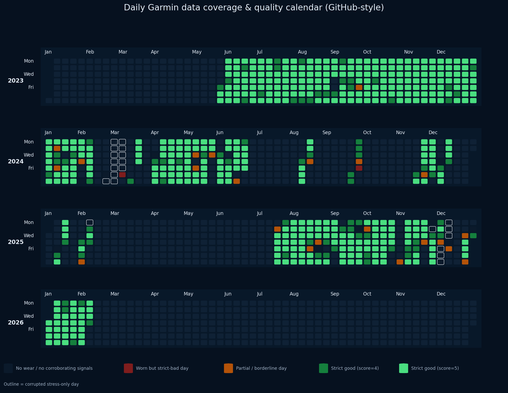
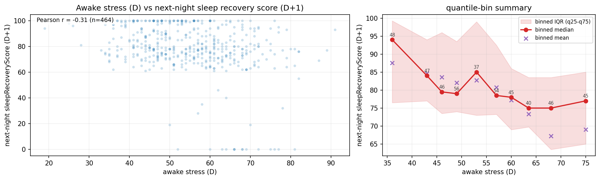

# Garmin Wearable Analytics

[](https://github.com/AlexBatrakov/wearable-analytics/actions/workflows/ci.yml)

Garmin Wearable Analytics is a privacy-first case study built on local Garmin exports. It turns messy nested JSON into curated parquet tables, applies sanitization and quality gating before analysis, and uses notebook-driven EDA to surface interpretable behavioral and recovery patterns. The project is packaged as a balanced DS/DA portfolio piece rather than a notebook dump or a pure engineering exercise.

If you open only one file after this page, start with [the case study](docs/case_study.md).

## What This Project Demonstrates

- Robust ingestion and normalization of heterogeneous wearable exports (`UDS` + sleep JSON) into stable day-level tables
- Privacy-aware preprocessing, with sanitization treated as a hard boundary before sharing or analysis
- Quality labeling and artifact review, including strict vs loose readiness logic and suspicious-day triage
- Structured EDA across coverage, time series, distributions, segmentation, and directed relationship analysis
- Reproducible Python project organization with CLI workflows, tests, and CI-backed iteration

## If You Have 60 Seconds

1. [Case study](docs/case_study.md)
2. [Relationships notebook](notebooks/04_eda_relationships.ipynb)
3. [Distributions notebook](notebooks/03_eda_distributions.ipynb)
4. [Pipeline overview](docs/pipeline.md)

## Headline Findings

- The dataset spans **580 daily rows** from **2023-05-26 to 2026-02-05**, with explicit quality-aware filtering before analysis.
- About **90.5%** of days are `strict good`, which makes the retained EDA slices analytically useful without hiding real-world coverage gaps.
- Weekly segmentation reveals stable routines: **Saturday** is the most active day, **Sunday** the least active, and **Tuesday** shows the highest median awake stress.
- Higher **daytime stress** is associated with worse **next-night recovery**, supporting a day-to-night carryover story rather than same-row coincidence only.
- **Sleep score** follows an optimum-duration pattern: mid-range sleep durations score best, while both shorter and longer nights tend to underperform.

## Featured Visuals



*Coverage calendar: the project keeps visible the difference between real behavioral variation and plain no-wear / partial-coverage periods.*


*Sleep score behaves like an optimum-duration pattern rather than a monotonic one: mid-range nights score better than both shorter and longer ones.*



*The strongest directional relationship in the repo is a negative association between daytime stress and next-night recovery score.*

## Project Structure

- **Pipeline / ingestion**: discover raw Garmin exports, flatten nested JSON, and build parquet checkpoints
- **Quality & privacy**: sanitize sensitive fields, generate a data dictionary, label day readiness, and isolate suspicious artifacts
- **EDA notebooks**: prepare coverage-aware slices, inspect time series, analyze distributions, and validate cross-metric relationships
- **Case study & docs**: recruiter-facing summary first, technical stage docs and notebooks second

## Results Snapshot

- rows: **580**
- date range: **2023-05-26 to 2026-02-05**
- strict labels: **good 90.52%, partial 3.79%, bad 5.69%**
- loose labels: **good 93.45%, partial 0.86%, bad 5.69%**
- corrupted stress-only days: **21 (3.62%)**

## Technical Appendix / Deep Dive

Start here for the portfolio narrative, then use the links below for technical depth:
- [Case study](docs/case_study.md)
- [Relationships notebook](notebooks/04_eda_relationships.ipynb)
- [Distributions notebook](notebooks/03_eda_distributions.ipynb)

- [Overview](docs/overview.md)
- [Pipeline](docs/pipeline.md)
- [EDA guide](docs/eda.md)
- [Stage 0](docs/stage0.md)
- [Stage 1](docs/stage1.md)
- [Stage 2](docs/stage2.md)
- [CLI](docs/cli.md)
- [Privacy](docs/privacy.md)

## Quickstart

```bash
python3 -m venv .venv
source .venv/bin/activate
python -m pip install -r requirements.txt
python -m pip install -e .
```

Primary CLI mode:

```bash
garmin-analytics discover
garmin-analytics ingest-uds
garmin-analytics ingest-sleep
garmin-analytics build-daily
garmin-analytics sanitize
garmin-analytics quality
```

Open notebooks:

```bash
jupyter lab
```

## Privacy

Raw Garmin exports stay local and must never be committed. Sanitized outputs are the default analysis and sharing boundary. See [docs/privacy.md](docs/privacy.md).
