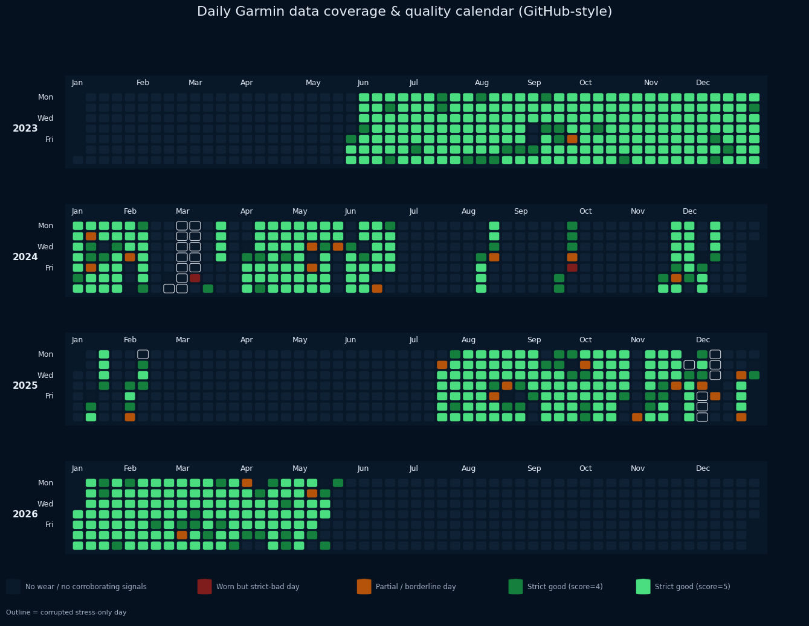
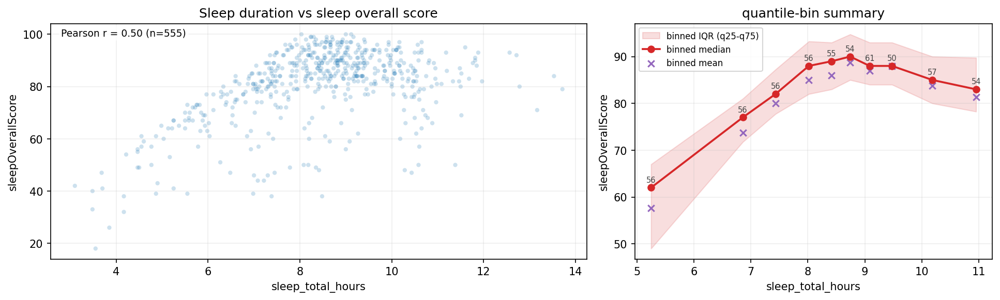
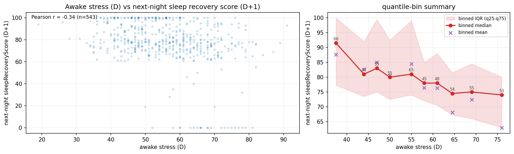

# Garmin Wearable Analytics

[](https://github.com/AlexBatrakov/wearable-analytics/actions/workflows/ci.yml)

Garmin Wearable Analytics is a privacy-first case study built on local Garmin exports. It turns messy aggregate JSON and minute-level FIT monitoring files into curated parquet tables, applies sanitization and quality gating before analysis, and uses notebook-driven EDA to surface interpretable behavioral and recovery patterns. The project is packaged as a balanced DS/DA portfolio artifact that combines analytical depth with reproducible engineering practices.

If you open only one file after this page, start with [the case study](docs/case_study.md).

## What This Project Demonstrates

- Robust ingestion and normalization of heterogeneous wearable exports (`UDS` + sleep JSON) into stable day-level tables
- Privacy-aware preprocessing, with sanitization treated as a hard boundary before sharing or analysis
- Quality labeling and artifact review, including strict vs loose readiness logic and suspicious-day triage
- SQL-first analytics layer (`DuckDB` primary + compact `PostgreSQL` showcase) with CTE/window/view patterns
- Structured EDA across coverage, time series, distributions, segmentation, and directed relationship analysis
- Time-aware Stage 3 extension with statistical validation plus classification/regression baselines
- Stage 4 monitoring extension with minute-level HR/stress FIT decoding, sleep-aware windows, quality index, and feature tables
- Reproducible Python project organization with CLI workflows, tests, and CI-backed iteration

## Role Fit

- Strongest fit: `DS generalist`, `Data Analyst`, `Product/Analytics`, and analytics-heavy data roles that value messy real-world data handling as much as final charts.
- Signals: raw nested JSON ingestion, privacy-safe preprocessing, quality-aware analysis, explicit limitations, and reproducible Python packaging.
- Framing: this repository emphasizes trustworthy analytics and interpretable findings over heavy production ML, which is intentional for the portfolio story.

## If You Have 60 Seconds

1. [Case study](docs/case_study.md)
2. [Stage 4 monitoring extension](docs/stage4_monitoring.md)
3. [Stage 3 (validation + modeling)](docs/stage3.md)
4. [SQL layer (DuckDB + PostgreSQL showcase)](docs/sql_layer.md)
5. [Relationships notebook](notebooks/04_eda_relationships.ipynb)

## Headline Findings

- The dataset spans **677 daily rows** from **2023-05-26 to 2026-05-18**, with explicit quality-aware filtering before analysis.
- About **91.1%** of days are `strict good`, which makes the retained EDA slices analytically useful without hiding real-world coverage gaps.
- Weekly segmentation reveals stable routines: **Saturday** is the most active day, **Sunday** the least active, and **Tuesday** shows the highest median awake stress.
- Higher **daytime stress** is associated with worse **next-night recovery**, supporting a day-to-night carryover story rather than same-row coincidence only.
- **Sleep score** follows an optimum-duration pattern: mid-range sleep durations score best, while both shorter and longer nights tend to underperform.

## Featured Visuals



*Coverage calendar: the project keeps visible the difference between real behavioral variation and plain no-wear / partial-coverage periods.*



*Sleep score behaves like an optimum-duration pattern rather than a monotonic one: mid-range nights score better than both shorter and longer ones.*



*The strongest directional relationship in the repo is a negative association between daytime stress and next-night recovery score.*

## Project Structure

- **Pipeline / ingestion**: discover raw Garmin exports, flatten nested JSON, and build parquet checkpoints
- **Quality & privacy**: sanitize sensitive fields, generate a data dictionary, label day readiness, and isolate suspicious artifacts
- **SQL layer (optional)**: build a DuckDB mart, run portfolio SQL packs, and mirror a compact schema in PostgreSQL
- **EDA notebooks**: prepare coverage-aware slices, inspect time series, analyze distributions, and validate cross-metric relationships
- **Monitoring extension**: decode minute-level FIT HR/stress records, build sleep-aware semantic windows, and publish quality/feature tables
- **Case study & docs**: recruiter-facing summary first, technical stage docs and notebooks second

## Results Snapshot

- rows: **677**
- date range: **2023-05-26 to 2026-05-18**
- strict labels: **good 91.14%, partial 3.69%, bad 5.17%**
- loose labels: **good 94.09%, partial 0.74%, bad 5.17%**
- corrupted stress-only days: **21 (3.10%)**

## Stage 3 Snapshot

- Primary task: predict whether `next-night sleepRecoveryScore < 75` with contiguous time-ordered splits.
- Best interpretable model family: sparse logistic variants using compact daytime stress and heart-rate context.
- Current selected test result: balanced accuracy **~0.68**, ROC-AUC **~0.71**, PR-AUC **~0.60**, F1 **~0.62**.
- Statistical validation supports key directional findings (for example, `daytime awake stress -> lower next-night recovery`).

## Stage 4 Monitoring Snapshot

- Decoded **3,562** Garmin monitoring FIT files from **10,236** FIT files seen, with **0** decode errors skipped.
- Built minute-level monitoring tables with **675,325** heart-rate rows and **889,323** stress rows.
- Created **556** semantic sleep windows, a **589-row** monitoring quality index, and core/full feature tables for downstream EDA/modeling.
- Keeps quality diagnostics separate from candidate features: `monitoring_quality_index.parquet` joins to feature tables on `analysis_window_id`.

## Technical Appendix / Deep Dive

Start here for the portfolio narrative, then use the links below for technical depth:
- [Case study](docs/case_study.md) - recruiter-friendly project narrative and key findings.
- [Relationships notebook](notebooks/04_eda_relationships.ipynb) - directional `D -> D+1` relationships and artifact checks.
- [Distributions notebook](notebooks/03_eda_distributions.ipynb) - metric distributions and segmented behavior patterns.
- [Overview](docs/overview.md) - map of stages, outputs, and how to navigate the repository.
- [Pipeline](docs/pipeline.md) - end-to-end flow from raw exports to analysis artifacts.
- [EDA guide](docs/eda.md) - notebook purpose, structure, and interpretation scope.
- [Stage 0](docs/stage0.md) - discovery, ingestion, and parquet build details.
- [Stage 1](docs/stage1.md) - sanitize, data dictionary, and quality labeling.
- [Stage 2](docs/stage2.md) - EDA workflow and promoted observational findings.
- [Stage 3](docs/stage3.md) - predictive modeling and lightweight statistical validation.
- [Stage 4](docs/stage4_monitoring.md) - minute-level FIT monitoring extension, quality index, and feature table contract.
- [SQL layer](docs/sql_layer.md) - DuckDB mart, SQL query pack, and PostgreSQL showcase.
- [CLI](docs/cli.md) - command reference, flags, outputs, and run order.
- [Privacy](docs/privacy.md) - guardrails for local-only data and safe publishing boundaries.

## Quickstart

```bash
python3 -m venv .venv
source .venv/bin/activate
python -m pip install -r requirements.txt
python -m pip install -e .
```

Primary CLI mode:

```bash
garmin-analytics discover
garmin-analytics ingest-uds
garmin-analytics ingest-sleep
garmin-analytics build-daily
garmin-analytics sanitize
garmin-analytics quality
```

Optional monitoring extension:

```bash
garmin-analytics ingest-monitoring-fit
garmin-analytics build-semantic-windows
garmin-analytics build-monitoring-features
garmin-analytics build-monitoring-datasets
```

Optional SQL layer:

```bash
garmin-analytics build-sql-mart
garmin-analytics run-sql-portfolio
```

Open notebooks:

```bash
jupyter lab
```

## Public Demo

If you do not have private Garmin exports, you can still exercise the public Stage 1 workflow on a tiny committed sample:

```bash
PYTHONPATH=src .venv/bin/python scripts/setup_public_demo.py
garmin-analytics data-dictionary --markdown-mode both
garmin-analytics quality
garmin-analytics build-sql-mart
garmin-analytics run-sql-portfolio
```

Details: [Public demo](docs/public_demo.md)

## SQL Showcase

DuckDB (primary local analytics mart):

```bash
garmin-analytics build-sql-mart
garmin-analytics run-sql-portfolio
```

PostgreSQL (compact production-like mirror):

- setup + runbook: [examples/postgres_showcase/README.md](examples/postgres_showcase/README.md)
- schema/views/queries: `examples/postgres_showcase/`
- SQL skills demonstrated: CTEs, window functions, day-to-next-day (`D -> D+1`) alignment, and view-based analytics contracts.

## Privacy

Raw Garmin exports stay local and must never be committed. Sanitized outputs are the default analysis and sharing boundary. See [docs/privacy.md](docs/privacy.md).
