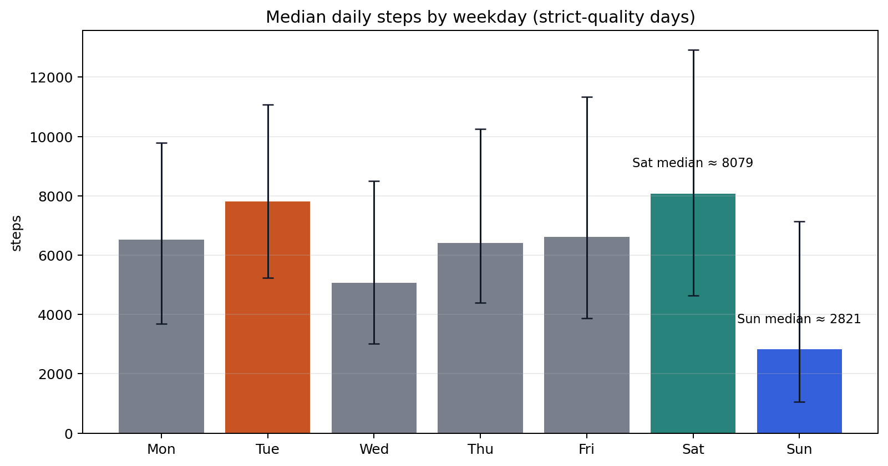
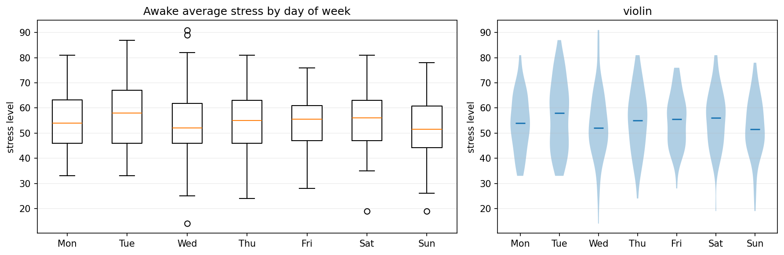
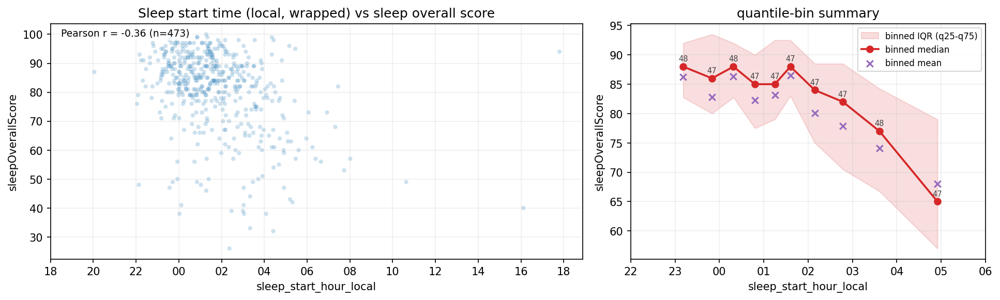
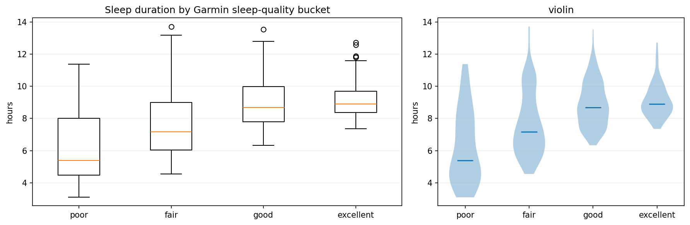
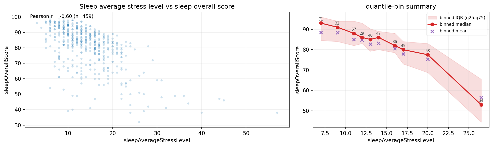
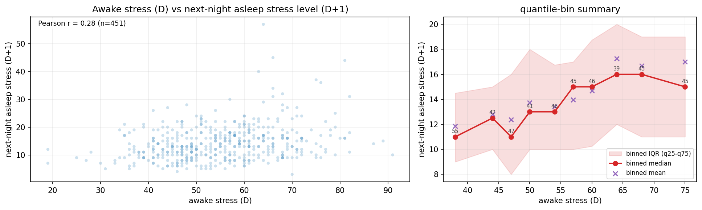
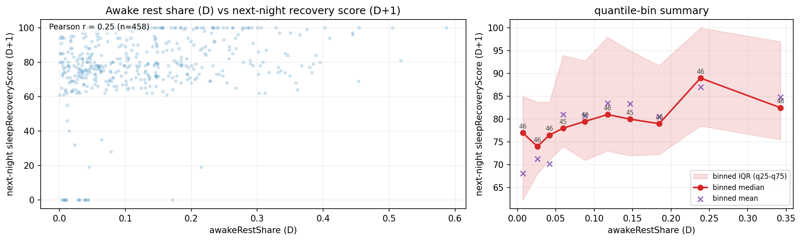

# Case Study: Privacy-First Garmin Wearable Analytics

## Executive Summary

This project turns local Garmin wearable exports into a privacy-safe analytics workflow that is strong enough to use as a DS/DA portfolio case study. The raw source data is messy: nested JSON, multiple export families, changing coverage over time, and model-derived device metrics that can be informative but are not always trustworthy at face value. To make the data usable, the project builds an end-to-end workflow: discover raw files, ingest them into parquet checkpoints, sanitize sensitive fields, generate a data dictionary, label day-level quality, and only then move into exploratory analysis. The final EDA is organized into four notebooks that cover coverage/readiness, time-series behavior, distributions and segmentation, and directed cross-metric relationships. The result is a repo that demonstrates not only plotting ability, but also data hygiene, quality-aware analysis, and careful interpretation of observational signals.

## Problem Framing

Personal wearable exports are not analysis-ready. They are nested, schema-heavy, and contain a mixture of direct measurements, inferred scores, partial-day records, and genuine no-wear gaps. On top of that, the data is privacy-sensitive, which means a shareable project cannot simply expose raw exports and hope the analysis looks polished afterward.

This project addresses that workflow end-to-end. Instead of treating notebooks as the only product, it treats analytics as a layered system: ingestion, privacy boundary, quality checks, and then interpretation. That framing is what makes the repo useful as a portfolio artifact for balanced DS/DA roles.

In practical terms, the project had to solve four non-trivial problems before any findings were worth looking at:
- flatten two different Garmin export families into one day-level analysis table
- keep the shareable boundary privacy-safe
- distinguish real behavior from no-wear / charging / partial-day artifacts
- avoid telling causal stories from noisy observational device summaries

## Data and Privacy Constraints

The source data comes from two Garmin export families stored locally under `data/raw/DI_CONNECT`:
- UDS aggregator exports with day-level nested wellness/activity summaries
- sleep export files with nightly sleep and respiration information

Those raw files are never part of the public-facing project story. The pipeline converts them into day-level parquet outputs and then applies a sanitize step to remove or suppress fields that are sensitive or analytically irrelevant. The sanitized outputs become the default boundary for analysis, sharing, and documentation. This is a deliberate design choice: the project demonstrates not just analysis skill, but disciplined handling of personal data.

## Pipeline Overview

Core project stages:
- **Stage 0**: discover raw files, ingest nested JSON, build canonical parquet datasets
- **Stage 1**: sanitize outputs, generate a data dictionary, and label day-level quality
- **Stage 2**: run notebook-based EDA with explicit quality-aware analysis slices

This matters because the repo is not just about “making charts”; it shows a complete local analytics workflow that can absorb imperfect personal data without pretending the imperfections do not exist.

## Quality and Trustworthiness

The analysis-ready dataset contains **580 daily rows** spanning **2023-05-26 to 2026-02-05**. Quality is not treated as an afterthought. Instead, each day is labeled under strict and loose readiness rules based on the availability of core signals such as steps, heart rate, stress duration, sleep coverage, and Body Battery end-of-day values.

Headline quality numbers:
- **Strict good**: `525 / 580` days (`90.52%`)
- **Strict partial**: `22 / 580` days (`3.79%`)
- **Strict bad**: `33 / 580` days (`5.69%`)
- **Corrupted stress-only days**: `21` dates (`3.62%`)

These labels are important because they separate genuine behavioral patterns from device artifacts. For example, some suspicious dates are truly corrupted stress-only runs, while others are partial but still plausible days where the watch likely ran out of battery before end-of-day.

*Coverage calendar: long dark spans reflect no-wear or no corroborating-signal periods, while orange/red clusters mark partial or bad-quality days that should not be interpreted like ordinary behavior.*

## Key Analytical Findings

### Behavioral Rhythms

The day-of-week segmentation shows that the dataset contains stable routines rather than pure noise. Saturday is the most active day in the strict-quality slice, with a median of about **8,079 steps**, while Sunday drops to roughly **2,822 steps**. This pattern is mirrored by `active_hours`, which peaks on Saturday and is lowest on Sunday. That consistency matters because it shows the signal is not just a quirk of one metric.

*Behavioral rhythm: median steps are highest on Saturday and lowest on Sunday, showing a stable weekly routine rather than random activity variation.*

Stress also has a weekly rhythm. Tuesday has the highest median awake stress in the strict-quality slice, at roughly **58**, which is materially above the calmer weekdays. This is a useful validation that the project can recover interpretable weekly structure from noisy wearable summaries rather than only producing generic distributions.

*Weekday stress segmentation: Tuesday stands out as the highest-stress weekday, while the overall weekly profile remains stable enough to interpret.*

### Sleep Quality Structure

Sleep quality is structured by both **duration** and **timing**. Duration does not improve score monotonically: the strongest nights cluster in a broad middle band rather than at the longest durations. Timing matters too: later sleep onset is associated with weaker scores even after handling the midnight wrap correctly. Taken together, these two plots are more informative than either one alone, because they show that Garmin sleep score is not just a proxy for “more hours is better”.

<table>
  <tr>
    <td></td>
    <td></td>
  </tr>
  <tr>
    <td><em>Sleep duration effect: the best nights cluster around a middle duration band, and the score drops away from that range rather than increasing indefinitely.</em></td>
    <td><em>Sleep timing effect: later sleep onset is associated with weaker Garmin sleep scores after midnight wrap is handled correctly.</em></td>
  </tr>
</table>

The segmented sleep buckets tell the same story from a different angle. Median sleep duration rises from roughly **5.4 hours** in poor-quality nights to about **8.9 hours** in excellent nights, which shows that duration matters, but only within a plausible range rather than at the extreme long end.

*Sleep quality buckets: better-scoring nights are clearly longer on average, but the relationship is structured rather than linear.*

Sleep stress is another strong driver. `sleepAverageStressLevel` is negatively associated with `sleepOverallScore` with a Pearson correlation of about **-0.60**, making it one of the clearest degraders of sleep quality in the whole project. This relationship is stronger and cleaner than many of the daytime activity effects.

*Sleep stress is one of the clearest score degraders: higher average asleep stress is associated with substantially worse sleep scores.*

### Day-to-Night Carryover

The most important directional relationship in the project is a carryover effect from daytime stress into the following night. `awakeAverageStressLevel (D)` is negatively associated with `next-night sleepRecoveryScore (D+1)` (Pearson about **-0.31**, `n≈464`). The broader pattern is not just about the average stress level either: days with a larger high-stress share tend to precede worse next-night recovery, while days with a larger rest share tend to precede better recovery.

*Day-to-night carryover: higher daytime stress is associated with weaker next-night recovery, making this one of the clearest directional findings in the repository.*

The same carryover appears in the next-night asleep stress signal. `awakeAverageStressLevel (D)` is positively associated with `sleepAverageStressLevel (D+1)` with a Pearson correlation of about **+0.28**. This is weaker than the recovery effect, but it supports the same interpretation: stress does not stay confined to the calendar day where it was recorded.

*Stress carryover: days with higher awake stress tend to be followed by nights with higher asleep stress as well.*

The composition of the day matters too. A larger `awakeRestShare` tends to precede better recovery, which is useful because it moves the analysis beyond one average stress metric and toward a more interpretable “stress vs recovery balance” framing.

*Stress composition matters: days with a larger rest share tend to be followed by stronger next-night recovery.*

There are also smaller but still interesting secondary effects. Very high-intensity activity is associated with shorter next-night REM duration, while total daily steps have much weaker and less intuitive next-night effects. That distinction is useful because it suggests ordinary movement and high-intensity load should not be treated as interchangeable. Another small but interpretable same-day pattern is that longer sleep is followed by fewer active hours, which is a reminder that some relationships in wearable data reflect time-budget tradeoffs rather than “better” or “worse” behavior in the abstract.

## What This Demonstrates as a DS/DA Project

This repo demonstrates more than one skill category:
- **Raw data wrangling**: nested JSON exports are flattened into consistent day-level tables
- **Schema handling**: sleep and UDS records are integrated without losing traceability of important fields
- **Privacy-aware preprocessing**: sanitize is treated as a first-class stage, not as a cosmetic cleanup
- **Quality-rule design**: strict and loose readiness labels make downstream analysis more defensible
- **EDA structuring**: the analysis is split into coverage, time series, distributions/segmentation, and relationships rather than dumped into one notebook
- **Interpretation discipline**: findings are framed as observational and cross-checked with artifact review
- **Reproducible repo organization**: CLI, tests, docs, and notebooks fit together as one workflow

That combination is exactly why the project is useful as a balanced DS/DA portfolio piece. It shows analytical judgment and data engineering maturity in the same artifact.

## Limitations

This is still a single-subject observational dataset. The metrics are wearable-derived and partly model-based, not clinical measurements. Coverage gaps, charging periods, and off-wrist artifacts can still shape some day-level aggregates even after quality filtering. The findings are therefore useful as disciplined observational insights, not as causal or medical claims.

## Where to Go Deeper

- [Notebook 02: curated time series](../notebooks/02_eda_timeseries.ipynb)
- [Notebook 03: distributions + segmentation](../notebooks/03_eda_distributions.ipynb)
- [Notebook 04: relationships + artifact review](../notebooks/04_eda_relationships.ipynb)
- [Pipeline overview](pipeline.md)
- [Stage 1: sanitize, data dictionary, quality](stage1.md)
- [Stage 2: EDA details](stage2.md)
