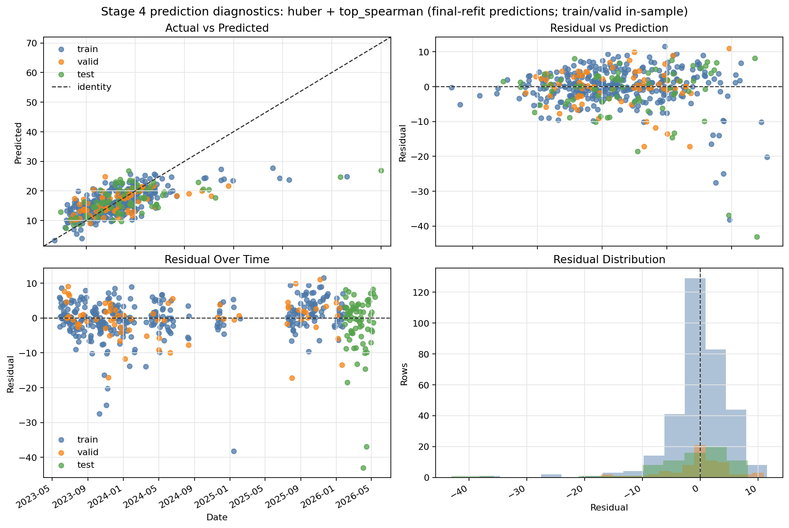
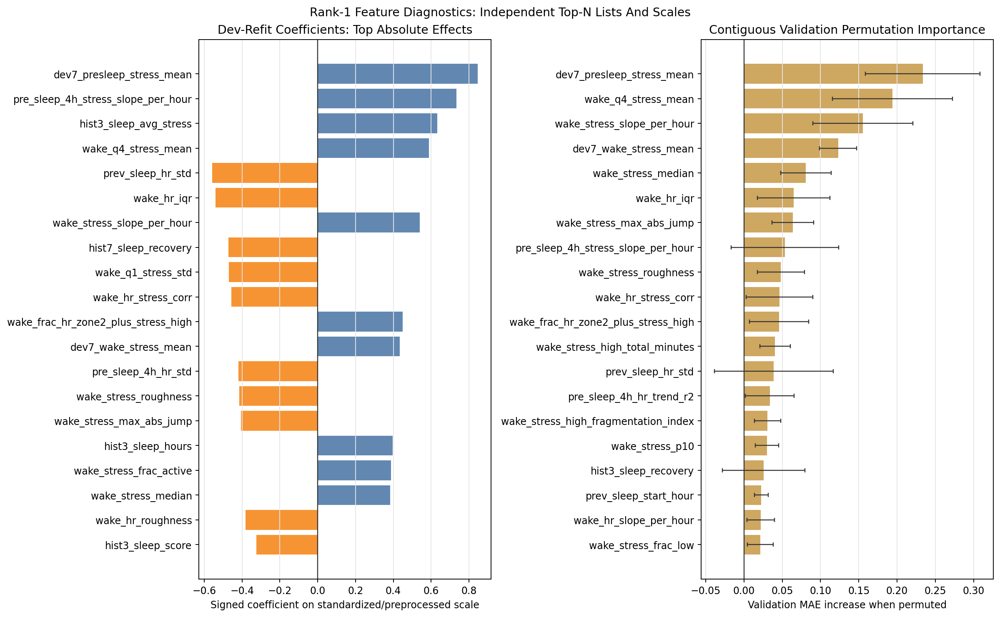

# Stage 4 - FIT Monitoring Extension

Stage 4 adds a minute-level Garmin FIT monitoring layer on top of the aggregate JSON pipeline.
It decodes heart-rate and stress monitoring records, aligns them to sleep-aware semantic windows, and publishes quality and feature tables for downstream EDA and modeling.

This is a data-product extension with a first exploratory linear-family modeling result. It is not a production predictor or health recommendation.

## Purpose

Stages 0-3 use day-level Garmin JSON exports: UDS wellness summaries plus sleep records.
Those tables are useful for broad patterns, quality labels, SQL views, EDA, and compact day-to-next-night modeling.

The FIT monitoring extension answers a different question:

- what happened inside the sleep and wake windows, minute by minute?
- how much usable HR/stress coverage exists within those windows?
- which compact features support leakage-aware next-sleep modeling?

## Why Minute-Level Monitoring Matters

Aggregate JSON metrics collapse each day into device summaries such as average awake stress, sleep score, steps, and heart-rate summaries.
FIT monitoring files preserve the underlying minute-level HR and stress observations.

That makes several analyses possible:

- separate sleep and wake physiology without relying on midnight-to-midnight calendar days
- measure coverage and gaps directly
- summarize stress-state composition, variability, trends, and sleep-wake contrasts
- keep quality/filtering diagnostics separate from candidate model features

## Pipeline

Run Stage 4 after the aggregate sleep and daily inputs exist.
`build-semantic-windows` uses `sleep.parquet` and, when available, `daily_uds.parquet` or `daily.parquet` for local UTC offset metadata.

```bash
garmin-analytics ingest-monitoring-fit
garmin-analytics build-semantic-windows
garmin-analytics build-monitoring-features
garmin-analytics build-monitoring-datasets
garmin-analytics build-stage4-modeling-frame
```

Current refreshed monitoring run:

- FIT files seen: `10,236`
- Monitoring FIT files decoded: `3,562`
- FIT decode errors skipped: `0`
- Heart-rate rows: `675,325`
- Stress rows: `889,323`
- Semantic sleep windows: `556`
- Monitoring daily foundation rows: `556`
- Monitoring quality rows: `589`
- Rows eligible for recovery modeling v0: `472`

## Output Contract

Minute-level canonical tables:

- `data/processed/monitoring_heart_rate.parquet`
- `data/processed/monitoring_stress.parquet`

Sleep-aware window and foundation tables:

- `data/processed/semantic_sleep_windows.parquet`
- `data/processed/monitoring_daily_features.parquet`
- `reports/monitoring_foundation_summary.md`

Quality and candidate feature tables:

- `data/processed/monitoring_quality_index.parquet`
- `data/processed/monitoring_features_core_v0.parquet`
- `data/processed/monitoring_features_full_v0.parquet`
- `reports/monitoring_quality_summary.md`
- `reports/monitoring_core_features_summary.md`
- `reports/monitoring_features_full_summary.md`
- `reports/monitoring_features_full_catalog.csv`
- `reports/monitoring_features_full_catalog.md`

As with the rest of the project, generated `data/` artifacts stay local and are not public data products.

## Semantic Sleep/Wake Windows

A semantic window is anchored on observed Garmin sleep:

- sleep phase: sleep start to wake time
- wake phase: wake time to the next accepted sleep start
- local date: derived from the source sleep record, with local UTC offset metadata when available

This is more meaningful for physiology than midnight-to-midnight grouping.
A sleep interval can start late at night, continue past midnight, and define the next wake period in local time.

The foundation layer preserves raw next-sleep observations and explicitly marks missing or late next-sleep boundaries.
The quality layer can then decide whether a window is plausible, late-but-usable, split into supported analysis windows, or excluded from baseline modeling eligibility.

## Quality Index

Quality and filtering live in `monitoring_quality_index.parquet`, not in the candidate feature tables.
Join it to feature tables on `analysis_window_id` before modeling or interpreting window-heavy features.

Current quality policy highlights:

- sleep duration plausibility: `2..16` hours
- wake duration plausibility: `6..30` hours
- baseline usable flags allow max gaps up to `360` minutes
- stricter gap sensitivity filters such as `*_max_gap_minutes <= 180` remain available
- baseline recovery eligibility requires plausible sleep/wake windows and usable whole sleep/wake HR/stress
- `pre_sleep_4h_usable` is optional and should be applied only for stricter pre-sleep analyses

The current quality index has `589` analysis rows, `524` rows with an observed next sleep boundary, and `472` rows eligible for recovery modeling v0.

## Feature Tables

Stage 4 publishes two cleaned candidate feature tables:

- core v0: `589 x 93`
- full v0: `589 x 243`

The full feature table covers `2023-05-27` to `2026-05-18`.

Core v0 is a compact starter subset for first-pass EDA/modeling.
Full v0 keeps a broader cleaned feature library with a catalog for selection and review.

Included feature families:

- distribution and shape summaries for HR and valid numeric stress
- stress state fractions
- maximum-heart-rate zone fractions
- gap-aware variability and jump diagnostics
- episode and state-structure summaries
- sleep/wake quarter summaries
- linear trends
- pre-sleep and recovery summaries
- sleep-wake contrasts
- HR/stress coupling

Excluded from candidate features:

- coverage fractions, max-gap metrics, and boundary timing diagnostics
- raw status-value diagnostic fractions except the curated active proxy
- broad anchored-window families from earlier experiments
- endpoint diagnostics and ad hoc contrasts
- broad experimental signal families outside the cleaned v0 contract

Those exclusions keep the modeling surface smaller and keep quality logic separate from predictors.

## Public Analytical Layer

The monitoring layer now has a public EDA notebook, a modeling-frame audit
notebook, and companion reports:

- `notebooks/07_monitoring_fit_eda.ipynb`: monitoring inventory, quality funnel, coverage diagnostics, feature-table overview, and a minute-level semantic-day browser.
- `reports/monitoring_eda_summary.md`: compact EDA summary for the current refreshed monitoring run.
- `notebooks/08_sleep_outcome_modeling_frame.ipynb`: target, eligibility, split, feature-set, and aggregate-candidate audit for the next sleep-outcome modeling pass.
- `notebooks/09_sleep_stress_linear_models.ipynb`: configurable repeated-holdout linear-family regression pass for next-sleep average stress.
- `reports/stage4_sleep_modeling_frame_summary.md`: reusable `day D -> next sleep` modeling-frame contract.
- `reports/stage4_sleep_modeling_feature_sets.md`: named aggregate, monitoring-core, monitoring-full, and combined feature spaces.
- `reports/stage4_sleep_stress_linear_models_summary.md`: validation-selected linear-model results and future-test dummy-baseline comparison.
- `reports/stage4_sleep_stress_linear_model_leaderboard.csv`: validation leaderboard with future-test metrics for selected finalists.
- `reports/stage4_sleep_stress_linear_model_grid.csv`: one-row-per-candidate audit of the linear experiment grid.
- `reports/stage4_sleep_stress_linear_best_by_model_family.csv`: compact validation-ranked comparison across linear model families and dummy baselines.
- `reports/stage4_sleep_stress_linear_rank1_feature_importance.csv`: coefficient and validation permutation-importance table for the validation rank-1 model.
- `docs/img/stage4_linear_prediction_diagnostics.png`: diagnostic panel for the validation-selected rank-1 finalist.
- `docs/img/stage4_linear_feature_importance.png`: rank-1 standardized-coefficient and validation permutation-importance diagnostic.

Notebook 07 is the right entry point for understanding what the monitoring data contains and how quality filtering changes the usable row set.
The notebook reads the current `data/processed/*.parquet` monitoring outputs directly and summarizes the feature families available for modeling.
Notebook 08 then checks the modeling frame before any model family is fit.
Notebook 09 makes the first modeling pass, exposes the main experiment controls and pre-fit cost plan, separates validation-only diagnostics from finalist refit, and keeps the final future test block reserved for validation-selected finalists. Its saved outputs preserve an expanded linear-family run, while the visible rerun defaults use a smaller preset with an explicit safety gate.

## Stress Status Semantics

Raw Garmin stress values are preserved, but they are not all numeric stress scores:

- `0..100`: valid numeric stress value
- `-1`: unmeasurable/status value
- `-2` with same-minute valid HR: active/large-motion proxy
- `-2` without same-minute valid HR: unmeasurable/status value

Numeric stress statistics use only raw `0..100` values.
Quality stress coverage counts raw `0..100` plus HR-confirmed `-2`.
Feature-state denominators exclude raw `-1`, raw `-2` without valid HR, and minutes with no stress row.

The curated `stress_frac_active` feature is therefore an activity/status proxy, not a Garmin numeric stress score.

## Linear Modeling Snapshot

Notebook 09 evaluates linear-family regression for next-sleep `avgSleepStress` using the Stage 4 `day D -> next sleep` modeling frame. The public headline uses validation-selected rank, not future-test selection.

- Target: `target_avgSleepStress_next_sleep`
- Feature set: `monitoring_full_wake_pre_sleep`
- Candidate features: `123`
- Expanded grid: `70,056` linear-family configurations
- Split strategy: future test block held out; repeated random train/validation holdouts inside pre-test history
- Validation-selected rank-1 model: `Huber alpha=30 eps=1.15 | top_spearman_90 | clip=z=4 | cal=linear`
- Mean validation MAE: `3.610`
- Future-test MAE: `5.336`
- Future-test R2: `0.279`
- Best future-test dummy baseline: `dummy_mean`, MAE `6.198`, R2 `-0.064`
- Improvement vs best dummy: `0.863` MAE points, or `13.9%`



*Prediction diagnostics show a modest future-holdout signal, while residual drift and high-stress-night underprediction remain visible.*



*Rank-1 diagnostics emphasize recent wake stress, pre-sleep stress, and heart-rate variability features. These associations are plausible, but not causal evidence.*

This linear pass is useful because it turns the monitoring layer into a transparent, leakage-aware modeling baseline. It is still a single-subject exploratory result and should not be read as a reliable night-level or medical predictor.

## Modeling Readiness

Stage 4 demonstrates the monitoring layer by providing:

- a canonical minute-level HR/stress table pair
- sleep-aware analysis windows
- explicit row-level quality and eligibility flags
- compact and full candidate feature tables
- a feature catalog with families, signals, phases, windows, and cautions
- a shared sleep-outcome modeling frame with target alignment, split policy, and named feature spaces
- public EDA, frame-audit, and linear-model notebooks that keep quality filtering, coverage, boundary confidence, feature-readiness, validation selection, and future-test evaluation visible

The current public result is intentionally scoped.
Its main value is showing a defensible bridge from raw minute-level series to drift-aware modeling: a quality-aware feature layer, validation-selected tuning, dummy-baseline comparison, and a future-holdout readout without claiming production prediction performance.

## Limitations

- This is single-subject observational wearable data.
- HR/stress monitoring is included; activity FIT files, movement monitoring, and unknown FIT message families are out of scope.
- Device-derived stress values are treated as Garmin status and summary signals, not as diagnostic measurements.
- Semantic windows depend on observed Garmin sleep boundaries and can still be affected by off-wrist, charging, travel, or device gaps.
- The monitoring feature tables and linear baseline are modeling artifacts, not a finished production prediction system.
